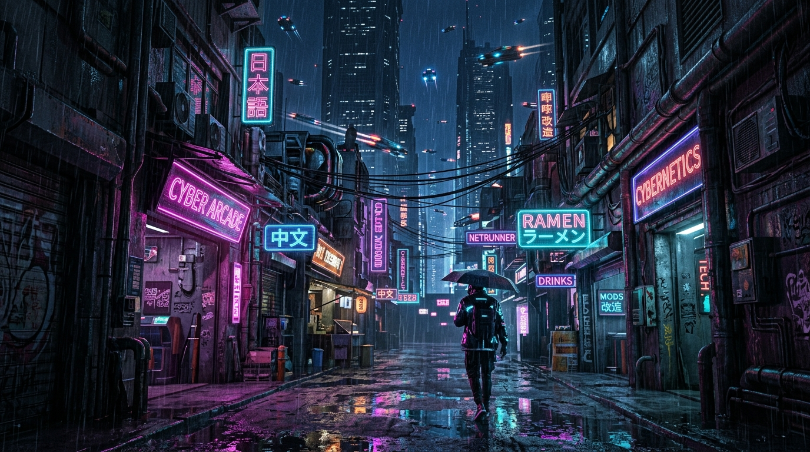

# 🔮 ChronoKuji（クロノクジ）— 時空超越型マルチバース AI おみくじ & 図鑑 PWA

<div align="center">

**[ 🇺🇸 English ](README.md) • [ 🇰🇷 한국어 ](README.ko.md) • [ 🇯🇵 日本語 ](README.ja.md)**

---



[](https://chronokuji.web.app)
[](https://fastapi.tiangolo.com)
[](https://react.dev)
[](https://vitejs.dev)
[](https://tailwindcss.com)
[](https://web.dev/progressive-web-apps/)
[](https://deepmind.google/technologies/gemini/)

**「12の世界観を行き交う時空ワープ、正統7大吉凶、そして LLM による深層運命解釈」**

[🌐 ライブアプリ起動 (Live App)](https://chronokuji.web.app) • [主な機能](#-主な機能) • [12大世界観](#-12大マルチバース世界観) • [システム構成](#-システムアーキテクチャ) • [ローカル起動ガイド](#-ローカル起動ガイド) • [免責事項](#-免責事項-disclaimer)

</div>

---

## 📖 プロジェクト概要 (Overview)

**ChronoKuji（クロノクジ）**は、日本の伝統的な神社おみくじ文化に、**12種類のサブカルチャー・マルチバース世界観**、**Google Gemini LLM による深層運勢相談 AI**、そして**クロノ・トリガー風の時空冒険サウンドスケープ**を融合させた次世代 Web アプリケーション（PWA）です。

時空の中心である**「次元の亀裂聖所」**を起点とし、旅人はテイルズウィーバー、千と千尋、サイバーパンク、ハリー・ポッター、インターステラーなどの名作世界へ移動し、固有のみくじ筒を振って 7 段階の伝統吉凶と 5 大運勢項目（願事・恋愛・金運・事業・旅行・待人）を占い、次元ラッキーアイテムを収集します。

---

## ✨ 主な機能 (Key Features)

### 1. ⚡ 次元跳躍 回生制動 (Regenerative Warp Braking)
- **インタラクティブ時空減速**: 60秒の時空航海中、画面（キャンバス）をタップするか専用制動ボタンを連打することで、次元膜の摩擦波動を逆位相コイルで吸収。
- **リアルタイム減速 (-3秒/回)**: 回生エネルギーを吸収するたびに到着時間が 3 秒短縮され、早期着陸を誘導。
- **臨場感あふれる視聴覚演出**: タップ地点から広がる**電磁イナズマアーク（Lightning Arc）**、二重衝撃波リング、放電パーティクル、浮遊テキスト（`⚡ 回生制動 -3s`）、そして Web Audio API による**未来型インバーター減速共鳴音 SFX**が発動。
- **段階別時空観測 Lore**: 15秒ごとの4段階フェーズ解説および5秒周期の次元キャリブレーションログ循環。

### 2. 🥠 正統おみくじ 7 段階吉凶 & 5 大運勢項目（84件マスターDB）
- **7大伝統吉凶**: `[ 大吉 | 中吉 | 小吉 | 吉 | 末吉 | 凶 | 大凶 ]`
- **ミニマル 5 大運勢項目**: 願事（Wish）、恋愛（Love）、金運（Wealth）、事業（Work）、旅行（Travel）、待人（Waiting）。
- **伝統の所作**: 運勢の漢詩、幸運の方位・数字、そして「結び処に結ぶ」または「財布に納める」インタラクション。
- **打鍵感あふれるみくじ筒演出**: モバイル加速度センサー対応、結果発表時には**朱色の落款印章が「ドンッ！」と押される視聴覚演出**。

### 3. 🌌 PC 大開放型 2 カラム・シネマティック UI & 🖼️ 鑑賞モード（Zen Mode）
- **鮮明なフルスクリーンキャンバス**: 世界観の高画質オリジナルイラストがブラウザ画面全体に広がり、臨場感あふれるダークビネットが適用されます。
- **超透明フローティンググラス**: 透過度 30% のグラスモフィズム（`backdrop-blur-2xl`）により、UI の隙間から背景が透けて見える圧倒的な開放感を実現。
- **🖼️ 鑑賞モード（Zen Mode）**: ワンクリックで全 UI を非表示にし、8K イラストと BGM のみをリラクゼーション鑑賞。

### 4. 🌀 凶（Kyo）反転・次元歪曲グリッチ演出
- 「凶」が出た場合、注意書きを閲覧後に下へスクロールすると**画面全体に紫色の次元歪曲グリッチ**が炸裂。*「もしかすると別の世界線では、この運勢は大吉かもしれません」*というメッセージと共に、**異世界からの救済ラッキーアイテム**が召喚されます。

### 5. 🎼 3段階ハイブリッド・スマートサウンド（`AudioEngine`）
- **3段階シームレスルーティング**:
  - 聖所ロビー: `Chrono Trigger — 風の憧憬 (Wind Scene)`
  - 時空ワープ中: `Chrono Trigger — 時の回廊 (Corridors of Time)`
  - 記録保管所: `メイプルストーリー — 次元の亀裂`
  - スポット到着: 各世界の代表曲（`Hedwig's Theme`, `Second Run`, `Interstellar Theme` 等）
- **YouTube バックグラウンドストリーミング**: ローカル MP3 がない場合でも、0px 透過 IFrame プレイヤーがリアルタイム配信。
- **Web Audio Synth バックアップ**: オフライン時でも回生制動音や環境音をブラウザ内蔵シンセが直接合成。

### 6. 🏛️ 次元の亀裂聖所 & 11種ラッキーアイテム図鑑（Codex）
- 時空の中心拠点**「次元の亀裂聖所」**にて、11大世界観の伝説ラッキーアイテム図鑑と過去の運命履歴を閲覧可能。
- 11種図鑑をすべてコンプリートすると、隠しスポット**「12. インターステラー テセラック」**が解放されます。

### 7. 🛡️ 永久完全無料（Zero-Cost Spark）& クライアントファースト PWA
- **クライアントファースト回復力**: バックエンドサーバーが停止しても、`LocalGameService` がローカルストレージを基盤に 100% 自律動作。
- **モバイル PWA 対応**: 専用黄金クッキーアプリアイコン、ホーム画面追加バナー、20時間 AI トークンリフィルタイマー、連続ログインストリーク搭載。

---

## 🗺️ 12大マルチバース世界観 (Multiverse Lineup)

| # | 世界観 (Spot) | コンセプト & 背景 | みくじ筒 (Gacha Box) | ラッキーアイテム (Item) | BGM トラック |
|---|---|---|---|---|---|
| 🌿 **1** | **テイルズウィーバー（クライデン平原）** | そよ風の草原 | ルーン刻印木製筒 | 風の羽 | `TalesWeaver - Second Run` |
| ⚡ **2** | **ポケットモンスター（ホドモエシティ）** | ネオン跳ね橋 / 電気 | ハイテクカプセル円筒 | モンスターボール | `Pokémon B&W - Driftveil City` |
| 🏮 **3** | **千と千尋（油屋）** | 紅の湯屋 / 神秘 | 朱漆塗り薬湯筒 | 薬湯札 | `Spirited Away - The Sixth Station` |
| 💾 **4** | **サイバーパンク（ナイトシティ）** | グリッチ高層ビル / ネオン | データコア円筒 | 神経加速器 | `Edgerunners - Stay at Your House` |
| 🍺 **5** | **シンプソンズ（モエの酒場）** | 行きつけのパブ / アニメ | オーク材ダフ樽 | ダフビール | `The Simpsons - Main Theme` |
| ⭐ **6** | **クレヨンしんちゃん（春日部児童公園）** | 夕暮れの公園 / 郷愁 | ピンク六角チョコビ箱 | チョコビ | `Crayon Shin-chan - Nostalgia Piano` |
| ✨ **7** | **葬送のフリーレン（オイサースト）** | 魔法試験場 / ルーン | 白銀の星図魔導円筒 | 古代魔導書 | `Frieren - Time Flows Ever Onward` |
| 🍁 **8** | **メイプルストーリー（リス港口）** | 冒険立ち寄る最初の港 | 方位磁針の冒険箱 | 赤い薬 | `MapleStory - Lith Harbor` |
| 👑 **9** | **塔の上のラプンツェル（コロナ王国）** | 黄金のランタン祭 | 太陽紋様ランタン筒 | 魔法のフライパン | `Tangled - I See the Light` *(大吉: Kingdom Dance)* |
| ❄️ **10** | **ハウリングアビス（フレヨルド）** | 厳寒の戦場 / 氷雪 | 永久凍土の氷壺 | ポロのおやつ | `League of Legends - Freljord` |
| 🕯️ **11** | **ハリー・ポッター（ホグワーツ大広間）** | 宙に浮く蝋燭の広間 | 組分け帽子のみくじ筒 | 金のスニッチ | `Harry Potter - Hedwig's Theme` |
| ⏳ **12** | **⭐ [隠し] インターステラー テセラック** | 5次元時空 / 本棚の裏 | 5次元重力立方体 | 量子重力時計 | `Hans Zimmer - Interstellar Theme` *(11種図鑑制覇で解放)* |

---

## 🏗️ システムアーキテクチャ (System Architecture)

```
[ Frontend (React 19 + Vite 8 + Tailwind) ]
   │
   ├── MapSelector & Hero Panorama Stage (鮮明な背景 + 2カラムワイド UI)
   ├── WarpInteractiveCanvas (イナズマアーク + 衝撃波 + 回生制動連打)
   ├── MovementTimer (回生制動パネル + 15秒段階別 Lore + 5秒ログ循環)
   ├── FortuneShakeModal (4回タップ / 加速度センサーみくじ筒)
   ├── OmikujiView (7大吉凶 + 5大運勢 + 凶反転 + 印章演出)
   ├── HistoryModal (過去のおみくじ & AI 解釈タイムライン)
   ├── CodexModal (11種次元ラッキーアイテム収集器)
   ├── LocalGameService (100% 自律動作クライアントファーストサービス)
   └── AudioEngine (シンセサイザー + YouTube バックグラウンド配信)
   │
   ▼ HTTP / JSON (任意バックエンド)
[ Backend (FastAPI + SQLAlchemy + SQLite) ]
   │
   ├── /api/v1/movement (60秒タイムロック & 回生制動同期)
   ├── /api/v1/omikuji (84件正統マスター DB & 履歴管理)
   ├── /api/v1/interpret (Google Gemini 2.5 Flash による総合相談)
   └── /api/v1/users (Google Auth / UUID ゲスト認証 & 20時間リフィル)
```

---

## 🚀 ローカル起動ガイド (Quick Start)

### 1. 必要環境
- **Python 3.10+**
- **Node.js 18+** & `npm`

### 2. クローン & セットアップ
```bash
git clone https://github.com/fairyofdata/ChronoKuji.git
cd ChronoKuji

# .env 作成 & Gemini API キー登録 (任意)
echo GEMINI_API_KEY=your_gemini_api_key_here > .env
```

### 3. ワンクリック起動 (`start.bat`)
Windows の場合はルートにある **`start.bat`** をダブルクリックするだけで、バックエンド起動、フロントエンドビルド、ブラウザ立ち上げが自動で行われます。

```bash
# 手動起動の場合:
# バックエンド
python -m venv venv
.\venv\Scripts\activate
pip install -r requirements.txt
python init_db.py
python seed_data.py
uvicorn main:app --reload --port 8000

# フロントエンド
cd frontend
npm install
npm run dev
```

---

## 🎵 BGM 追加ガイド (Optional)

著作権遵守のため、市販の `.mp3` ファイルは含まれていません。デフォルトでは **YouTube バックグラウンド配信** および **Web Audio API プロシージャルシンセ** が自動再生されます。

原曲をお持ちの場合は、以下のディレクトリに配置することで高音質ローカル再生が可能です：
- `frontend/public/assets/audio/bgm/chrono_wind_scene.mp3`
- `frontend/public/assets/audio/bgm/chrono_corridors_of_time.mp3`
- `frontend/public/assets/audio/bgm/spot_1_kraiden.mp3` ~ `spot_12_tesseract.mp3`
- `frontend/public/assets/audio/bgm/extra/tangled_kingdom_dance.mp3`

---

## ⚖️ 免責事項 (Disclaimer)

- 本プロジェクトは**非営利ファンメイド（Fan-made）のオープンソースプロジェクト**です。
- 作品内の世界観（IP）、キャラクター、作品名の知的財産権および商標権は、各正当な権利者に帰属します。
- 背景およびアイテムイラストは Google AI により非商用目的で独自生成されたデジタルアセットです。
