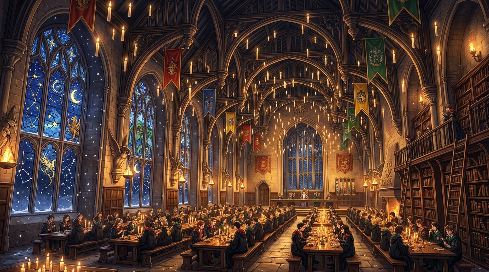

# 🔮 ChronoKuji（クロノクジ）— 時空超越型マルチバース AI おみくじ & 図鑑 PWA

<div align="center">

**[ 🇺🇸 English ](README.md) • [ 🇰🇷 한국어 ](README.ko.md) • [ 🇯🇵 日本語 ](README.ja.md)**

---



[](https://fastapi.tiangolo.com)
[](https://react.dev)
[](https://vitejs.dev)
[](https://tailwindcss.com)
[](https://web.dev/progressive-web-apps/)
[](https://deepmind.google/technologies/gemini/)

**「12の世界観を行き交う時空ワープ、正統7大吉凶、そして LLM による深層運命解釈」**

[主な機能](#-主な機能) • [12大世界観](#-12大マルチバース世界観) • [システム構成](#-システムアーキテクチャ) • [ローカル起動ガイド](#-ローカル起動ガイド) • [免責事項](#-免責事項-disclaimer)

</div>

---

## 📖 プロジェクト概要 (Overview)

**ChronoKuji（クロノクジ）**は、日本の伝統的な神社おみくじ文化に、**12種類のサブカルチャー・マルチバース世界観**、**Google Gemini LLM による深層運勢相談 AI**、そして**クロノ・トリガー風の時空冒険サウンドスケープ**を融合させた次世代 Web アプリケーション（PWA）です。

旅人は 60 秒の時空ワープを経て、テイルズウィーバー、千と千尋、サイバーパンク、ハリー・ポッター、インターステラーなどの名作世界へ移動し、固有のみくじ筒を振って 7 段階の伝統吉凶と 5 大運勢項目（願事・恋愛・金運・事業・旅行・待人）を占い、次元ラッキーアイテムを収集します。

---

## ✨ 主な機能 (Key Features)

### 1. 🥠 正統おみくじ 7 段階吉凶 & 5 大運勢項目（84件マスターDB）
- **7大伝統吉凶**: `[ 大吉 | 中吉 | 小吉 | 吉 | 末吉 | 凶 | 大凶 ]`
- **ミニマル 5 大運勢項目**: 願事（Wish）、恋愛（Love）、金運（Wealth）、事業（Work）、旅行（Travel）、待人（Waiting）。
- **伝統の所作**: 運勢の漢詩、幸運の方位・数字、そして「結び処に結ぶ」または「財布に納める」インタラクション。

### 2. 🌌 PC 大開放型 2 カラム・シネマティック UI & 🖼️ 鑑賞モード（Zen Mode）
- **鮮明なフルスクリーンキャンバス**: 世界観の高画質オリジナルイラストがブラウザ画面全体に広がり、臨場感あふれるダークビネットが適用されます。
- **超透明フローティンググラス**: 透過度 30% のグラスモフィズム（`backdrop-blur-2xl`）により、UI の隙間から背景が透けて見える圧倒的な開放感を実現。
- **🖼️ 鑑賞モード（Zen Mode）**: ワンクリックで全 UI を非表示にし、8K イラストと BGM のみをリラクゼーション鑑賞。

### 3. 🌀 凶（Kyo）反転・次元歪曲グリッチ演出
- 「凶」が出た場合、注意書きを閲覧後に下へスクロールすると**画面全体に紫色の次元歪曲グリッチ**が炸裂。*「もしかすると別の世界線では、この運勢は大吉かもしれません」*というメッセージと共に、**異世界からの救済ラッキーアイテム**が召喚されます。

### 4. 🎼 3段階ハイブリッド・スマートサウンド（`AudioEngine`）
- **3段階シームレスルーティング**:
  - 聖所ロビー: `Chrono Trigger — 風の憧憬 (Wind Scene)`
  - 時空ワープ中: `Chrono Trigger — 時の回廊 (Corridors of Time)`
  - 記録保管所: `メイプルストーリー — 次元の亀裂`
  - スポット到着: 各世界の代表曲（`Hedwig's Theme`, `Second Run`, `Interstellar Theme` 等）
- **YouTube バックグラウンドストリーミング**: ローカル MP3 がない場合でも、0px 透過 IFrame プレイヤーがリアルタイム配信（著作権・リポジトリ容量リスクゼロ）。
- **Web Audio Synth バックアップ**: オフライン時でもブラウザ内蔵シンセサイザーが環境音を合成して無音を防止。

### 5. 🏛️ 次元の亀裂聖所 & 運命の記録保管所（Fate Archive）
- 図鑑や過去の運命履歴は、時空の中心拠点である**「次元の亀裂聖所」**でのみ閲覧可能。
- 各世界から聖所へ帰還し、過去のおみくじ結果や AI 解釈履歴をタイムラインカードで振り返ることができます。

### 6. 📱 モバイル PWA 対応 & リテンション
- 専用ゴールドクッキーアプリアイコン & ホーム画面追加バナー（インストール時に **+1 ボーナストークン付与**）。
- 20時間トークンクールダウンタイマー & 連続ログイン（Streak）バッジ。

---

## 🗺️ 12大マルチバース世界観

| # | 世界観・場所 | コンセプト・雰囲気 | みくじ筒 (Box) | ラッキーアイテム | BGM トラック |
|---|---|---|---|---|---|
| 🌿 **1** | **クライデン平原 (テイルズウィーバー)** | 爽やかな草原と自由の風 | ルーン木彫りのみくじ筒 | 風の羽 | `TalesWeaver - Second Run` |
| ⚡ **2** | **ホドモエの跳ね橋 (ポケモン)** | ネオン跳ね橋と電撃 | ハイテクカプセルシリンダー | モンスターボール | `Pokémon B&W - Driftveil City` |
| 🏮 **3** | **油屋・湯屋 (千と千尋の神隠し)** | 朱塗りの湯屋と神秘 | 朱塗り薬湯筒 | 薬湯札 | `Spirited Away - The Sixth Station` |
| 💾 **4** | **ナイトシティ (サイバーパンク2077)** | グリッチビルとネオン街 | データコアシリンダー | 神経加速器 | `Edgerunners - Stay at Your House` |
| 🍺 **5** | **モーの酒場 (ザ・シンプソンズ)** | アニメ調のパブ | オーク製ダフ樽 | ダフビール | `The Simpsons - Main Theme` |
| ⭐ **6** | **カスカベ公園 (クレヨンしんちゃん)** | 夕暮れの公園と思い出 | チョコビ六角ピンク箱 | チョコビ | `Crayon Shin-chan - Nostalgia Piano` |
| ✨ **7** | **オイサースト試験場 (葬送のフリーレン)** | 魔法陣とルーン文字 | 銀色の魔導占星筒 | 古代の魔導書 | `Frieren - Time Flows Ever Onward` |
| 🍁 **8** | **リス港口 (メイプルストーリー)** | 冒険者の始まりの港 | 羅針盤の冒険者宝箱 | 赤い薬 | `MapleStory - Lith Harbor` |
| 👑 **9** | **コロナ王国 (塔の上のラプンツェル)** | ランタンの夜空とお祭り | 黄金の太陽ランタン筒 | 魔法のフライパン | `Tangled - I See the Light` *(大吉: Kingdom Dance)* |
| ❄️ **10** | **ハウリングアビス (リーグ・オブ・レジェンド)** | 凍てつく氷河の戦場 | 永久凍土の氷壺 | ポロスナック | `League of Legends - Freljord` |
| 🕯️ **11** | **ホグワーツ大広間 (ハリー・ポッター)** | 浮かぶロウソクと魔法 | 組分け帽子のみくじ筒 | 金のスニッチ | `Harry Potter - Hedwig's Theme` |
| ⏳ **12** | **⭐ [隠し] 5次元テセレクト (インターステラー)** | 5次元の時空格子 | 5次元キューブ重力筒 | 量子重力腕時計 | `Hans Zimmer - Interstellar Theme` *(11種図鑑コンプで解禁)* |

---

## 🏗️ システムアーキテクチャ

```
[ フロントエンド (React 19 + Vite 8 + Tailwind CSS) ]
   │
   ├── MapSelector & Hero Stage (開放型 2 カラム レスポンシブ UI)
   ├── FortuneShakeModal (4回タップ / ジャイロ振動による筒振り)
   ├── OmikujiView (7大吉凶 + 5大運勢 + 凶反転グリッチ)
   ├── HistoryModal (時系列運命 & AI 深層解釈アーカイブ)
   ├── CodexModal (11次元ラッキーアイテム収集図鑑)
   └── AudioEngine (シングルトン BGM + YouTube IFrame + Web Synth)
   │
   ▼ HTTP / JSON
[ バックエンド (FastAPI + SQLAlchemy + SQLite) ]
   │
   ├── /api/v1/movement (60秒タイムロック & 遅延評価による到着検証)
   ├── /api/v1/omikuji (84件事前キャッシュマスターDB & 履歴保存)
   ├── /api/v1/interpret (Google Gemini 2.5 Flash によるキャラクター解釈)
   └── /api/v1/users (UUID ゲスト認証 & 20時間トークンクールダウン)
```

---

## 🚀 ローカル起動ガイド

### 1. 必要環境
- **Python 3.10+**
- **Node.js 18+** & `npm`

### 2. クローンと初期設定
```bash
git clone https://github.com/fairyofdata/ChronoKuji.git
cd ChronoKuji

# .env ファイル作成と Google Gemini API キー設定
echo GEMINI_API_KEY=your_gemini_api_key_here > .env
```

### 3. ワンクリック起動 (`start.bat`)
Windows 環境では、ルートの **`start.bat`** をダブルクリックするだけでバックエンド起動、フロントエンドビルド、ブラウザ表示が自動実行されます。

```bash
# 手動起動手順:
# バックエンド
python -m venv venv
.\venv\Scripts\activate
pip install -r requirements.txt
python init_db.py
python seed_data.py
uvicorn main:app --reload --port 8000

# フロントエンド
cd frontend
npm install
npm run dev
```

---

## ⚖️ 免責事項 (Disclaimer)

- 本プロジェクトは**非営利のファンメイド・オープンソース・トイプロジェクト**です。
- 作品名、キャラクター名、ロゴなどの商標および知的財産権は、それぞれの権利所有者に帰属します。
- 本リポジトリ内の背景およびアイテムイラストは、Google AI を用いて独自生成された非営利ファンアートです。
