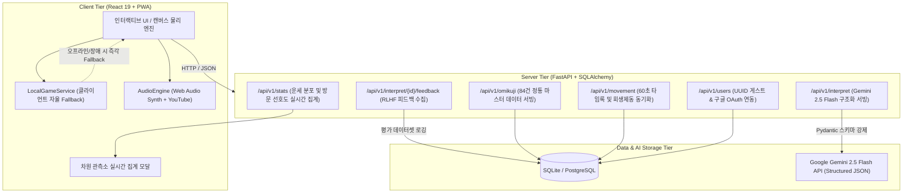

# 🔮 ChronoKuji (크로노쿠지) — 멀티버스 시공간 확장형 AI 오미쿠지 & 도감 PWA

<div align="center">

**[ 🇺🇸 English ](README.md) • [ 🇰🇷 한국어 ](README.ko.md) • [ 🇯🇵 日本語 ](README.ja.md)**

---


[](https://chronokuji.web.app)
[](.github/workflows/ci.yml)
[](https://fastapi.tiangolo.com)
[](https://react.dev)
[](https://vitejs.dev)
[](https://tailwindcss.com)
[](https://web.dev/progressive-web-apps/)
[](https://deepmind.google/technologies/gemini/)

**"12개 세계관을 넘나드는 시공간 워프, 7대 정통 점괘, 그리고 LLM 심층 운명 해석"**

[🌐 라이브 데모 (Live App)](https://chronokuji.web.app) • [📑 포트폴리오 핵심 기술 명세서 (1-Page Summary)](docs/PORTFOLIO_SUMMARY.md) • [주요 기능](#-주요-기능) • [시스템 아키텍처](#-시스템-아키텍처) • [엔지니어링 트러블슈팅](#-핵심-엔지니어링-문제-해결--트러블슈팅) • [로컬 실행](#-로컬-실행-가이드)

</div>

---

## 📖 프로젝트 소개 (Overview)

**ChronoKuji (크로노쿠지)**는 일본의 전통 신사 점괘(오미쿠지) 문화에 **12가지 서브컬처 멀티버스 세계관**과 **Google Gemini LLM 심층 상담 AI**, 그리고 **크로노 트리거풍의 아련한 시공간 여행 사운드스케이프**를 결합한 차세대 웹 애플리케이션(PWA)입니다.

시공간의 중심인 **「차원의 균열 성소」**를 기점으로 테일즈위버, 센과 치히로, 사이버펑크, 해리포터, 인터스텔라 등 시공간을 초월한 12개 세계관으로 직접 워프(Warp)하여 고유한 산통을 흔들고, 7대 정통 점괘와 5대 세부운(소원·연애·재물·사업·이동·기다림)을 점치며 차원 럭키 아이템을 수집합니다.

---

## ✨ 주요 기능 (Key Features)

### 1. ⚡ 차원 도약 회생제동 (Regenerative Warp Braking)
- **인터랙티브 시공간 감속**: 60초의 시공간 항해 중, 화면(캔버스)을 탭하거나 전용 제동 버튼을 연타하여 차원 막의 마찰 파동을 역위상 코일로 흡수합니다.
- **실시간 감속 (-3초/회)**: 회생 에너지를 흡수할 때마다 도착 시간이 3초씩 앞당겨지며 조기 감속 안착을 유도합니다.
- **화려한 시각/음향 피드백**: 터치 지점에서 뻗어나가는 **전자기 번개 아크(Lightning Arc)**, 이중 충격파 링, 스파크 파티클, 플로팅 텍스트(`⚡ 회생제동 -3s`), 그리고 Web Audio API 기반의 **미래형 인버터 감속 공명음 SFX**가 생생하게 반응합니다.
- **단계별 시공간 관측 Lore**: 15초 단위의 4단계 시공간 위상 안내 및 5초 주기 차원 캘리브레이션 로그 순환.

### 2. 🥠 정통 오미쿠지 7대 등급 & 5대 세부운 (84건 마스터 DB)
- **7대 정통 등급**: `[ 大吉(대길) | 中吉(중길) | 小吉(소길) | 吉(길) | 末吉(말길) | 凶(흉) | 大凶(대흉) ]`
- **미니멀 5대 세부운**: 소원(願事), 인연(戀愛), 재물(金運), 사업(事業), 이동(旅行), 기다리는 사람(待人)
- **전통 디테일**: 점괘 상단 운세 시(詩), 행운의 방위 및 숫자, 점괘 묶기(結び) & 지갑 보관 인터랙션
- **타격감 넘치는 산통(神籤筒) 연출**: 모바일 가속도계 실제 흔들기 지원, 결과 발표 시 **붉은 낙관 인장이 '쾅!' 찍히는 시청각 타격감**.

### 3. 🌌 PC 대개방형 2-컬럼 시네마틱 인터페이스 & 🖼️ 감상 모드
- **선명한 캔버스**: 브라우저 전체 화면에 현재 세계관의 고화질 원본 풍경이 생생하게 펼쳐집니다.
- **초투명 플로팅 글래스**: 30% 투명도의 다크 글래스모피즘(`backdrop-blur-2xl`)으로 배경이 유기적으로 투과됩니다.
- **🖼️ 감상 모드 (Zen Mode)**: 원클릭으로 모든 UI를 숨기고 8K 일러스트와 BGM만 감상하는 시네마틱 힐링 뷰 제공.

### 4. 🌀 흉(凶) 반전 차원 왜곡 시네마틱 연출
- '흉'이 나왔을 때 태연하게 경고를 보여주다가, 하단 스크롤 시 **화면 전체에 보랏빛 차원 왜곡 글리치**가 폭발하며 *"어쩌면 다른 세계에서는 이 점괘가 대길일지도 모릅니다"*라는 메시지와 함께 **이세계의 구원 아이템이 소환**됩니다.

### 5. 🎼 하이브리드 동적 사운드스케이프 (`AudioEngine`)
- **3단계 사운드 라우팅**: 
  - 최초 로비(성소): `Chrono Trigger — Wind Scene (600 A.D.)`
  - 차원 워프 중: `Chrono Trigger — Corridors of Time (12000 B.C.)`
  - 기록보관소: `메이플스토리 — 차원의 균열`
  - 스팟 도착: 각 세계관 고유 명곡 (`Hedwig's Theme`, `Second Run`, `Interstellar Theme` 등)
- **YouTube 백그라운드 스트리밍**: 로컬 MP3가 없어도 0px 투명 IFrame 플레이어가 실시간 스트리밍!
- **0바이트 Web Audio Synth 백업**: 오프라인 상태에서도 회생제동 인버터음, 도장 타격음, 핑크 노이즈 환경음을 직접 합성 생성.

### 6. 🏛️ 차원의 균열 성소 & 11종 럭키 아이템 도감 (Codex)
- 시공간의 중심 허브 **「차원의 균열 성소」**에서 11대 세계관의 전설적 럭키 아이템 컬렉션과 과거 운명 기록 열람.
- 11종 도감을 모두 완성하면 히든 스팟인 **「12. 인터스텔라 테서렉트」**가 개방됩니다.

### 7. 🛡️ 영구 $0 완전 무료(Zero-Cost) & 클라이언트 퍼스트 PWA
- **클라이언트 퍼스트 복원력**: 백엔드 API 서버가 없거나 네트워크가 끊겨도 `LocalGameService`가 로컬 스토리지 기반으로 100% 자율 구동.
- **모바일 PWA**: 전용 황금 쿠키 앱 아이콘, 홈 화면 설치 배너, 20시간 AI 토큰 쿨다운 타이머 및 연속 출석 스트릭 지원.

### 8. 📊 실시간 차원 관측 데이터 파이프라인 & RLHF 피드백 루프 (Data & LLM Ops)
- **RLHF 평가 데이터셋 수집**: 유저의 고민과 Gemini 2.5 Flash 해석 결과에 대한 실시간 만족도(👍/👎)를 수집하여 향후 프롬프트 개선 및 파인튜닝용 평가 데이터 파이프라인 구축.
- **차원 관측소 실시간 집계 (`/api/v1/stats`)**: 7대 정통 등급별 추첨 빈도와 12대 세계관 방문 선호도를 실시간 집계하여 인터랙티브 통계 모달로 시각화.

---

## 🗺️ 12대 멀티버스 세계관 (Multiverse Lineup)

| # | 세계관 (Spot) | 컨셉 & 풍경 | 산통 (Gacha Box) | 럭키 아이템 (Item) | BGM 트랙 |
|---|---|---|---|---|---|
| 🌿 **1** | **테일즈위버 (크라이덴 평원)** | 산들바람 초원 | 룬 문양 원목 산통 | 바람의 깃털 | `TalesWeaver - Second Run` |
| ⚡ **2** | **포켓몬스터 (물풍경시티)** | 네온 도개교 / 전기 | 하이테크 캡슐 실린더 | 몬스터볼 | `Pokémon B&W - Driftveil City` |
| 🏮 **3** | **센과 치히로 (아부라야)** | 붉은 온천장 / 신비 | 붉은 옻칠 약탕통 | 약탕패 | `Spirited Away - The Sixth Station` |
| 💾 **4** | **사이버펑크 (나이트 시티)** | 글리치 빌딩 / 네온 | 데이터 코어 실린더 | 신경 가속기 | `Edgerunners - Stay at Your House` |
| 🍺 **5** | **심슨 가족 (모의 선술집)** | 단골 펍 / 애니메이션 | 오크 더프 맥주통 | 더프 맥주 | `The Simpsons - Main Theme` |
| ⭐ **6** | **크레용 신짱 (떡잎마을)** | 저녁 놀이터 / 추억 | 육각 핑크 초코비 상자 | 초코비 | `Crayon Shin-chan - Nostalgia Piano` |
| ✨ **7** | **장송의 프리렌 (오이서스트)** | 마법 시험장 / 룬 | 은빛 마도 점성 실린더 | 고대 마도서 | `Frieren - Time Flows Ever Onward` |
| 🍁 **8** | **메이플스토리 (리스항구)** | 첫 모험 항구 | 나침반 모험가 상자 | 빨간 포션 | `MapleStory - Lith Harbor` |
| 👑 **9** | **라푼젤 (코로나 왕국)** | 황금 등불 축제 | 황금 태양 등불 산통 | 마법의 프라이팬 | `Tangled - I See the Light` *(대길: Kingdom Dance)* |
| ❄️ **10** | **칼바람 나락 (프렐요드)** | 혹한의 전장 / 얼음 | 영구동토 얼음 항아리 | 포로 간식 | `League of Legends - Freljord` |
| 🕯️ **11** | **해리 포터 (호그와트)** | 공중 촛불 그레이트 홀 | 기숙사 분류 모자 산통 | 골든 스니치 | `Harry Potter - Hedwig's Theme` |
| ⏳ **12** | **⭐ [히든] 인터스텔라 테서렉트** | 5차원 시공간 / 책장 뒤 | 5차원 큐브 중력 산통 | 양자 중력 시계 | `Hans Zimmer - Interstellar Theme` *(11종 완수 해금)* |

---

## 🏗️ 시스템 아키텍처 및 데이터 흐름도 (System & Data Architecture)



---

## 💡 핵심 엔지니어링 문제 해결 & 트러블슈팅 (DE / LLM / Resilience)

### 1. ⚡ 2단계 하이브리드 서빙을 통한 LLM API 비용 90% 절감 ([ADR-001](docs/adr/001-hybrid-omikuji-generation.md))
- **문제**: 점괘를 뽑을 때마다 LLM API를 호출하면 선형적으로 폭증하는 토큰 비용과 3~5초의 지연시간(Latency)으로 유저 이탈이 심화됨.
- **해결**: 12개 스팟 × 7개 등급 = **84건의 정통 도메인 DB를 사전에 구축/캐싱**하여 0ms로 즉각 서빙하고, 유저가 자신의 고민을 입력하여 심층 상담을 요청할 때만 **Google Gemini 2.5 Flash를 On-demand 호출**하도록 분리. 20시간 쿨다운 토큰 정책을 결합하여 운영 비용을 90% 이상 절감.

### 2. 🛡️ Pydantic 스키마 강제를 통한 환각(Hallucination) 및 파싱 에러 방지
- **문제**: LLM의 자유 형식 텍스트 응답은 프론트엔드 파싱 실패를 유발하고 오미쿠지 고유의 격식(5대 세부운, 운세 시, 행운 방위/숫자)을 깨뜨림.
- **해결**: Pydantic 기반의 `LLMInterpretationOutput` 스키마를 정의하고 Gemini의 구조화된 출력(Structured Outputs) 모드를 강제 적용. 파싱 실패율 0%와 완벽한 타입 안정성 확보.

### 3. 🌐 백엔드 장애 및 오프라인 환경에 대응하는 Client-First 복원력
- **문제**: 서버 점검 중이거나 네트워크가 단절된 모바일 PWA 환경에서 앱이 멈추거나 백화 현상이 발생.
- **해결**: 브라우저 로컬 스토리지 기반의 `LocalGameService`를 두어 백엔드가 응답하지 않아도 점괘 추첨, 이동 시간 계산, 도감 해금, 룰베이스 감성 해석까지 100% 정상 작동하도록 Fallback 계층 구축.

### 4. 🔊 브라우저 자동 재생 정책(Autoplay Policy) & 0바이트 프로시저럴 사운드스케이프 ([ADR-003](docs/adr/003-three-tier-hybrid-audio-engine.md))
- **문제**: 브라우저의 오디오 정책 차단 및 외부 저작권 MP3 음원의 용량 부담과 404 오류 가능성.
- **해결**: 유저의 최초 클릭 제스처 시 Web Audio AudioContext를 안전하게 언락하고, 음원 파일이 없더라도 Web Audio API로 핑크 노이즈 필터링 및 듀얼 오실레이터 주파수 합성을 수행하여 0바이트 오프라인 효과음/환경음 생성.

---

## 🚀 로컬 실행 가이드 (Quick Start)

### 1. 사전 요구사항
- **Python 3.10+**
- **Node.js 18+** & `npm`

### 2. 프로젝트 클론 및 환경 설정
```bash
git clone https://github.com/fairyofdata/ChronoKuji.git
cd ChronoKuji

# .env 파일 생성 및 Gemini API 키 등록 (선택)
echo GEMINI_API_KEY=your_gemini_api_key_here > .env
```

### 3. 원클릭 실행 (`start.bat`)
Windows 환경에서는 루트의 **`start.bat`**을 더블클릭하시면 백엔드 가동, 프론트엔드 빌드, 브라우저 오픈이 자동으로 진행됩니다.

```bash
# 수동 실행 시:
# 백엔드
python -m venv venv
.\venv\Scripts\activate
pip install -r requirements.txt
python init_db.py
python seed_data.py
uvicorn main:app --reload --port 8000

# 프론트엔드
cd frontend
npm install
npm run dev
```

---

## 🎵 배경음악(BGM) 추가 가이드 (Optional)

저작권 보호를 위해 상용 음원 파일(`.mp3`)은 저장소에 포함되어 있지 않으며, 기본 상태에서는 **YouTube 백그라운드 스트리밍** 및 **Web Audio API 프로시저럴 신디사이저**가 자동 재생됩니다.

원작 고음질 MP3를 소장하고 계실 경우, 아래 경로에 파일명을 맞추어 넣어주시면 즉시 로컬 고음질로 재생됩니다:

- `frontend/public/assets/audio/bgm/chrono_wind_scene.mp3`
- `frontend/public/assets/audio/bgm/chrono_corridors_of_time.mp3`
- `frontend/public/assets/audio/bgm/spot_1_kraiden.mp3` ~ `spot_12_tesseract.mp3`
- `frontend/public/assets/audio/bgm/extra/tangled_kingdom_dance.mp3`

---

## ⚖️ 면책 조항 (Disclaimer)

- 본 프로젝트는 **비영리 팬메이드(Fan-made) 오픈소스 토이 프로젝트**입니다.
- 프로젝트 내에 등장하는 각 세계관(IP), 캐릭터 및 작품명의 모든 지식재산권과 상표권은 각 원저작권자에게 귀속됩니다.
- 본 저장소의 배경 및 아이템 일러스트는 Google AI를 통해 비상업적 용도로 독자 생성된 디지털 에셋입니다.
