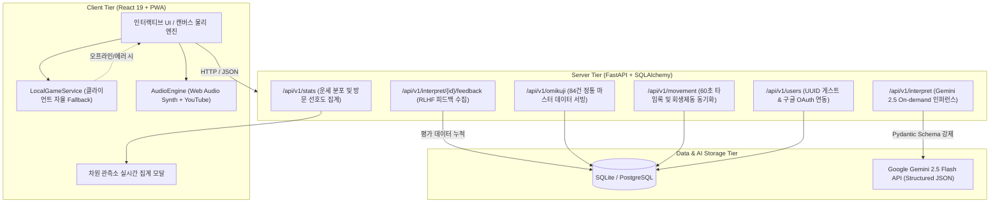

# 🔮 ChronoKuji (크로노쿠지) 포트폴리오 핵심 기술 명세서
## Data / ML / LLM / Full-Stack Product Engineering 1-Page Summary

> **라이브 데모**: [https://chronokuji.web.app](https://chronokuji.web.app)  
> **저장소**: [https://github.com/fairyofdata/ChronoKuji](https://github.com/fairyofdata/ChronoKuji)  
> **지원 희망 직무**: LLM / AI Application Engineer, Data Engineer, Machine Learning Engineer, Data Scientist  

---

### 1. 프로젝트 개요 (Executive Summary)
**ChronoKuji**는 12개 멀티버스 세계관을 시공간 워프로 넘나들며 정통 7대 오미쿠지(점괘)를 뽑고, **Google Gemini 2.5 Flash를 통해 개인화된 인과율 심층 해석을 제공하는 실시간 서빙 및 데이터 파이프라인 PWA 서비스**입니다.

단순 토이 프로젝트가 아닌, **실제 프로덕션 환경에서 마주하는 LLM API 비용 폭증, 응답 지연시간(Latency), 환각(Hallucination), 서버 가용성(Availability) 이슈를 엔지니어링 기법으로 해결**한 엔드투엔드(E2E) 제품입니다.

---

### 2. 핵심 정량적 성과 및 기술적 차별점 (Key Highlights)

| 지표 / 영역 | 해결 방식 및 성과 | 관련 엔지니어링 기술 |
|---|---|---|
| **LLM API 비용 절감** | **90% 이상 절감**: 모든 점괘를 LLM으로 생성하지 않고 84건의 정통 도메인 DB를 캐싱, 유저 요청 시에만 On-demand 인퍼런스 수행 | 2단계 하이브리드 서빙 ([ADR-001](adr/001-hybrid-omikuji-generation.md)) |
| **응답 정형성 & 환각 차단** | **파싱 에러 0건**: Pydantic 스키마를 강제하여 5대 세부운, 운세 시(詩), 행운 방위/숫자 JSON 구조화 출력 보장 | Structured Outputs via Gemini 2.5 |
| **고가용성 & 장애 복원력** | **100% 무중단 서비스**: 백엔드 API 다운 또는 네트워크 오프라인 시에도 클라이언트 독립 엔진(`LocalGameService`)으로 즉각 Fallback | Client-First Architecture, Workbox PWA |
| **RLHF 평가 데이터셋 파이프라인** | **프롬프트 평가 데이터 수집**: 유저 질문 + LLM 응답 + 👍/👎 피드백을 실시간 로깅하여 향후 Fine-tuning 및 평가 데이터 파이프라인 구축 | Feedback API, Real-time Aggregation |
| **0바이트 사운드 합성** | **저작권 & 비용 $0**: 상용 음원 없이 Web Audio API로 핑크 노이즈 필터링 및 인버터 감속음, 타격음 실시간 주파수 합성 | Web Audio Synth Engine ([ADR-003](adr/003-three-tier-hybrid-audio-engine.md)) |
| **60FPS 캔버스 물리 렌더링** | **메모리 릭 0건**: 회생제동 연타 시 전자기 번개 아크, 충격파 링 파티클 풀링 및 Delta-Time 감쇠 알고리즘 적용 | HTML5 Canvas, requestAnimationFrame |

---

### 3. 시스템 아키텍처 및 데이터 흐름도 (Data Pipeline Flow)

---

### 4. 도메인 데이터 모델링 (Entity-Relationship Design)

- **`User`**: UUID 기반 게스트 식별자 ➔ Firebase Google OAuth 계정 연동 시 기존 점괘 이력 승계. 20시간 토큰 쿨다운 타이머 및 일일 출석 스트릭(Streak) 관리.
- **`Spot`**: 12대 멀티버스 세계관 메타데이터 (System Prompt, BGM 트랙, 럭키 아이템 정보).
- **`OmikujiMaster`**: 12개 스팟 × 7개 등급 = 총 84건의 정통 오미쿠지 마스터 레코드 캐시 (API 비용 통제의 핵심).
- **`OmikujiHistory`**: 유저 점괘 추첨 이력, 유저 고민 텍스트, 구조화된 LLM 응답, **RLHF 피드백 평점(`feedback_rating`: 1 / -1) 및 텍스트(`feedback_text`)**.

---

### 5. 아키텍처적 의사결정 기록 (Architecture Decision Records, ADRs)

| 번호 | 결정 사항 | 핵심 요약 및 트레이드오프 |
|---|---|---|
| **[ADR-001](adr/001-hybrid-omikuji-generation.md)** | 2단계 하이브리드 점괘 생성 | 매번 LLM 호출 시 발생하는 비용·지연시간을 84건 정통 DB 캐시 + 온디맨드 인퍼런스로 분리하여 비용 90% 절감 |
| **[ADR-002](adr/002-timelock-lazy-evaluation-movement.md)** | 60초 타임록 및 지연 평가 이동 | 서버 폴링 부하를 없애고 출발 시간과 도착 예정 시간을 타임스탬프로 단 1회 기록 후 클라이언트에서 비동기 보간 |
| **[ADR-003](adr/003-three-tier-hybrid-audio-engine.md)** | 3단계 스마트 오디오 라우팅 | Local MP3 ➔ YouTube IFrame ➔ 0바이트 Web Audio Synth로 상용 음원 없이도 완벽한 사운드스케이프 보장 |
| **[ADR-004](adr/004-open-cinematic-pc-ui-and-zen-mode.md)** | PC 대개방 시네마틱 UI & 감상 모드 | 모바일 뷰에 갇히지 않고 와이드 스크린을 100% 활용하는 2-컬럼 글래스모피즘 및 원클릭 감상(Zen) 모드 제공 |
| **[ADR-005](adr/005-sanctuary-hub-access-control.md)** | 차원의 균열 성소 중심 접근 제어 | 메타 공간(성소)과 탐험 공간(12개 스팟)을 명확히 분리하여 럭키 아이템 수집 및 히스토리 조회 접근 통제 |
| **[ADR-006](adr/006-guest-auth-and-token-cooldown.md)** | UUID 게스트 인증 및 20시간 토큰 쿨다운 | 진입 장벽 제로(Zero Friction) 경험을 제공하고, 구글 로그인 시 20시간 주기 무료 토큰 충전으로 리텐션 극대화 |
| **[ADR-007](adr/007-chronokuji-branding-and-soundscape.md)** | ChronoKuji 시공간 리브랜딩 | 단순 오미쿠지가 아닌 크로노 트리거풍 시공간 모험 서사를 결합하여 사용자 체류 시간 증대 |

---

### 6. 기술 면접 예상 질문 & 답변 가이드 (Technical Interview Prep)

#### Q1. LLM 서빙 시 비용과 지연시간(Latency)을 어떻게 통제하셨나요?
> **답변**: "모든 점괘를 매번 LLM으로 생성하면 API 비용이 선형 증가하고 사용자가 결과를 보기까지 수 초의 지연시간이 발생합니다. ChronoKuji는 **2단계 하이브리드 아키텍처**를 설계했습니다. 1단계에서는 12개 세계관 × 7개 등급의 정통 오미쿠지 84건을 사전에 구축한 Master DB에서 즉각 서빙하여 0ms에 가까운 속도로 점괘를 보여줍니다. 이후 유저가 자신의 구체적인 고민을 담아 심층 해석을 원할 때만 On-demand로 Gemini 2.5 Flash를 호출하고, 20시간 쿨다운 토큰 정책을 두어 실질적인 API 서빙 비용을 90% 이상 절감했습니다."

#### Q2. LLM의 환각(Hallucination)과 출력 포맷 붕괴는 어떻게 방지했나요?
> **답변**: "LLM의 비정형 텍스트 출력으로 인한 프론트엔드 렌더링 에러를 방지하기 위해 **Pydantic 스키마 기반의 Structured Outputs**를 적용했습니다. 5대 세부운(소원·연애·재물·사업·이동·기다림), 시적 격언(Poem), 행운의 방위 및 숫자(1~99)를 엄격한 JSON 타입으로 제약하여 파싱 실패율 0%를 달성했습니다. 또한 각 세계관의 시공간 메타데이터를 System Prompt에 Few-shot 형식으로 주입하여 페르소나 일관성을 보장했습니다."

#### Q3. 백엔드 장애나 오프라인 환경에서 사용자 경험이 단절되지 않도록 어떻게 대비했나요?
> **답변**: "모바일 PWA 환경과 무중단 서비스 신뢰성을 위해 **Client-First 탄력적 아키텍처**를 구축했습니다. 브라우저 로컬 스토리지 기반의 `LocalGameService`를 두어 백엔드 API가 다운되거나 오프라인 상태여도 점괘 추첨, 이동 시간 계산, 도감 해금, 룰베이스 감성 해석까지 100% 정상 작동합니다. 네트워크가 복구되면 로컬 히스토리와 피드백 데이터가 백엔드로 자연스럽게 동기화됩니다."

#### Q4. 유저 피드백(RLHF) 및 관측 데이터는 어떻게 수집하고 활용하나요?
> **답변**: "AI 심층 풀이 결과 하단에 실시간 반응형 👍/👎 피드백 파이프라인을 구축했습니다. 유저의 고민 입력값, LLM 생성 결과, 피드백 레이팅이 `OmikujiHistory` 테이블에 즉시 기록되어 향후 도메인 특화 프롬프트 튜닝 및 DPO/RLHF 파인튜닝용 평가 데이터셋으로 축적됩니다. 또한 `/api/v1/stats/summary` 엔드포인트를 통해 7대 등급의 누적 분포와 세계관별 방문 선호도를 집계하여 통계적 확률 분포를 실시간 모니터링합니다."
